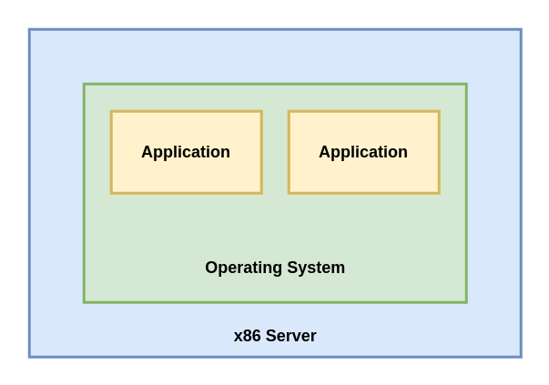
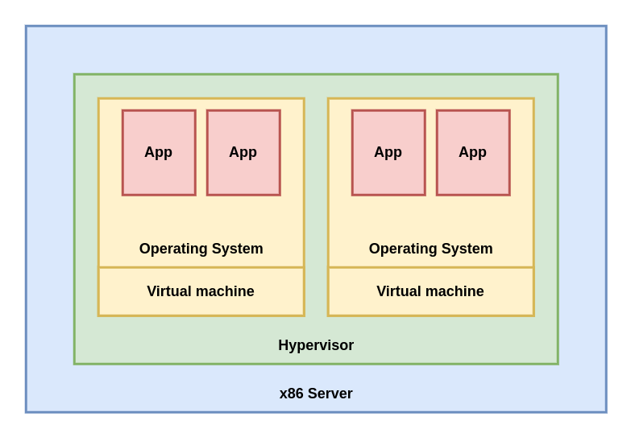
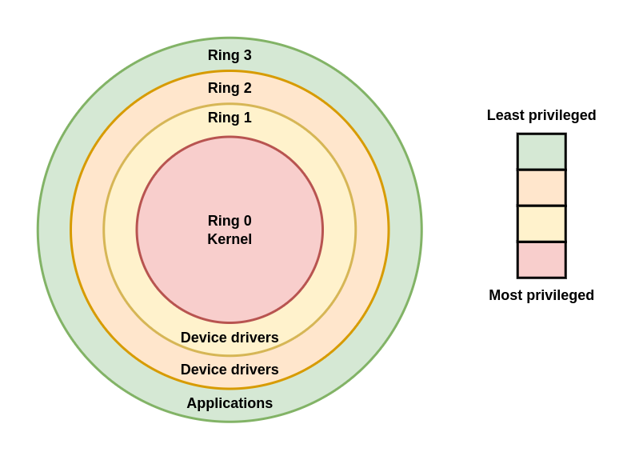
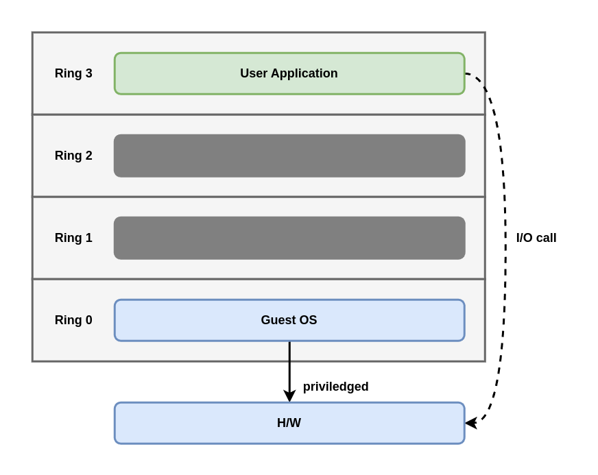
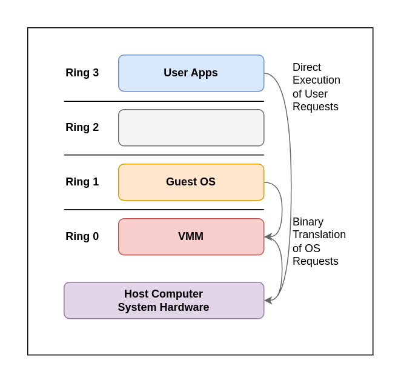
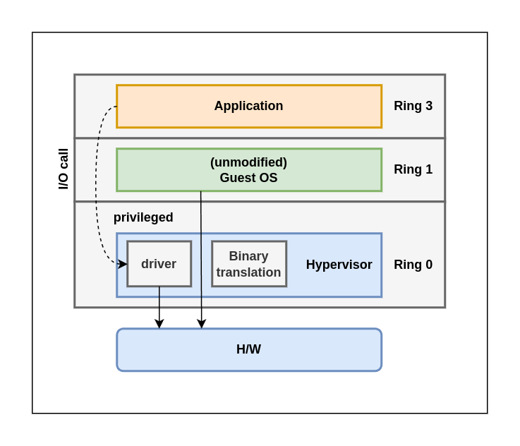

# Chapter 2. KVM as a Virtualizaton Solution

Discuss virtualizaton as a concept and its implementation via libvirt, Quick Emulator (QEMU), and KVM. 

In this chapter, we will cover the following topics:

- Virtualizaton as a concept.
- The internal workings of libvirt, QEMU, and KVM.
- How all these communicate with each other to provide virtualizaton.

## Virtualizaton as a concept

Virtualizaton is a computing approach that decouples hardware from software.

If we were to compare traditional, physical computing of the past with virtualizaton, we can say that by virtualizing, we get the possibility to run multiple guest OSes (multiple virtual servers) on the same piece of hardware (same physical server). If we're using a type 1 hypervisor, this means that the hypervisor is going to be in charge of letting the virtual servers access physical hardware. This is because there is more than one virtual server using the same hardware as the other virtual servers on the same physical server. This is usually supported by some kind of scheduling algorithm that's implemented programmatically in hypervisors so that we can get more efficiency from the same physical server.

### Virtualized versus physical environments

In a physical server, we're installing an OS right on top of the server hardware and running applications on top of that OS. The following diagram shows us how this approach works:

In a virtualized world, we're running a hypervisor (such as KVM), and virtual machines on top of that hypervisor. Inside these virtual machines, we're running the same OS and application, just like in the physical server.

There are still various scenarios in which the physical approach is going to be needed. For example, there are still thousands of applications on physical servers all over the world because these servers can't be virtualized. 

### Why is virtualizaton so important?

A lot of applications that we run today don't scale up well (adding more CPU, memory, or other resources) - they just aren't programmed that way or can't be seriously parallelized.

TODO: read again
### Hardware requirements for virtualization?

a CPU that had an awful log more features and power. This led to a big push toward hardware-assisted virtualization, which - on paper - looked like the faster and more advanced way to go. Just as an example, there were a whole bunch of CPUs that didn't support hardware-assisted virtualization in the 2003-2006 timeframe, such as the Intel Pentium 4, Pentium D, the intial AMD Athlons, Turions, Durons, and so on. It took both Intel and AMD until 2006 to have hardware-assisted virtualization as a feature that's more widely available on their respective CPUs. Furthermore, it took some time to have 64-bit CPUs, and there was little or no interest in running hardware virtualization on 32-bit architectures. The primary reason for this was the fact that you couldn't allocate more than 4GB or memory, which severely limited the scope of using virtualization as a concept.

**1. Second-level Address Translation, Rapic Virtualization Indexing, Extended Page Tables (SLAT/RVI/EPT) support:**

**2. Intel VT or AMD-V support:** If an Intel CPU has VT (or an AMD CPU has AMD-V), that means that it supports hardware virtualization extensions and full virtualization.

**3. Long mode support**

**4. The possibility of having Input/Output Memory Management Unit (IOMMU) virtualization (such as AMD-Vi, Intel VT-d, and stage 2 tables on ARM)**

...

### Software requirements for virtualization

Now that we've covered the basic hardware aspects of virtualization, let's move on to the software aspect of virtualization. To do that, we must cover some jargon in computer science.

Ring 0 is the level with the most privilege and interacts directly with physical hardware, such as the CPU and memory. The resources, such as memory, I/O ports, and CPU instructions, are protected via these priviled rings. Rings 1 and 2 are mostlly unused. Most general-purpose systems use only two rings, even if the hardware they run on provides more CPU modes than that. The two main CPU modes are the kernel mode and the user modes, which are also related to the way processes are executed. From an OS's point of view, ring 0 is called the kernel mode/supervisor mode and ring 3 is the user mode. As you may have assumed, applications run in ring 3.

OSer such as Linux and Windows use supervisor/kernel and user mode. This mode can do almost nothing to the outside world without calling on the kernel or without its help due to its restricted access to memory, CPU, and I/O ports. The kernels can run in privileged mode, which means that they can run on ring 0. To perform specialized functions, the user-mode code (all the applications that run in ring 3) must perform a system call to the supervisor mode or even to the kernel space, where the trusted code of the OS will perform the needed task and return the execution back to the userspace. In short, the OS runs in ring 0 in a normal environment.

The rings above 0 run instructions in a processor mode called unprotected. The hypervisor/Virtual Machine Monitor (VMM) needs to access the memory, CPU, and I/O devices of the host. Since only the code running in ring 0 is allowed to perform these operations, it needs to run in the most privileged ring, which is ring 0, and has to be placed next to the kernel. Without specific hardware virtualization support, the hypervisor or VMM runs in ring 0; this basically blocks the virtual machine's OS in ring 0. So the virtual machine's OS must reside in ring 1. An OS installed in a virtual machine is also expected to access all resources as it's unaware of the virtualization layer; to achieve this, it has to run in ring 0, similar the VMM. Due to the fact that only one kernel can run in ring 0 at a time, the guest OSes have to run in another ring with fewer privileges or have to be modified to run in user mode.

This has resulted in the introduction of a couple of virtualization methods called full virtualization and paravirtualization, which we mentioned earlier.

#### Full virtualization

In full virtualization, privileged instructions are emulated to overcome the limitations that arise from the guest OS running in ring 1 and the VMM running in ring 0. Full virtualization was implemented in first-generatoin x86 VMMs. It relies on techniques such as binary translation to trap and virtualize the execution of certain sensitive and non-virtualizable instructions. This being said, in binary translation, some system calls are interpreted and dynamically rewritten. The following diagram depict how the guest OS accesses the host computer hardware through ring 1 for privileged instructions and how unprivileged instructions are executed without the involvement of ring 1:

With this approach, the critical instructions are discovered (statically or dynamically at runtime) and replaced with traps in the VMM that are to be emulated in software. A binary translation can incur a large performance overhead in comparison to a virtual machine running on natively virtualized architectures. This can be seen in the following diagram:

However, as shown in the preceding diagram, when we use full virtualization, we can use the unmodified guest OSes. This means that we don't have to alter the guest kernel so that is runs on a VMM. When the guest kernel executes privileged operations, the VMM provides the CPU emulation to handle and modify the protected CPU operations. However, as we mentioned earlier, this cause performance overhead compared to the other mode of virtualization, called paravirtualization.

#### Paravirtualization
